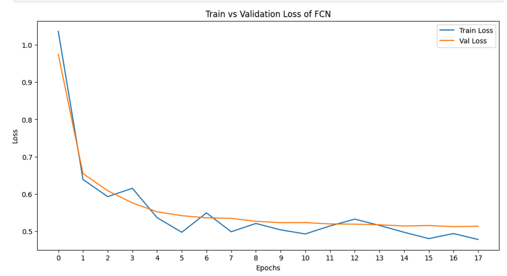
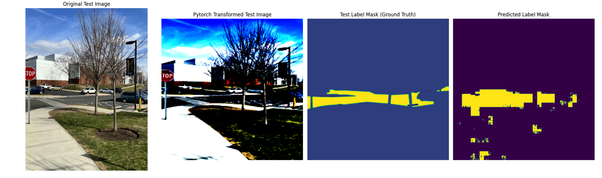

## road-semantic-segmentation
Computer vision task that involves using the novel FCN8 architecture to perform semantic segmentation of roads in an image
Pytorch was used to implement the FCN-8 network architecture.

Results:
Validation loss decreased until it plateaued at 0.51 as seen below:

The average test loss was 0.113. 

 

 

## Usage:
- pip install gradio

- python road_segmentation_app.py

- copy and paste the local host url in browser

- upload picture containing road for segmentation

## Info:
**Models** folder contains some the models trained during development

**road_segmentation_app.py** is the python file that runs the gradio app that consumes the model

**images & labels** contain the dataset that was used for training and testing

**results** contain some result screenshots

  
## Presentation & Demo
I talk about the project and demo it in this short clip: https://www.linkedin.com/posts/godswill-ikwan_computervision-ai-deeplearning-activity-7191995750090702848-9J1b?utm_source=share&utm_medium=member_desktop

